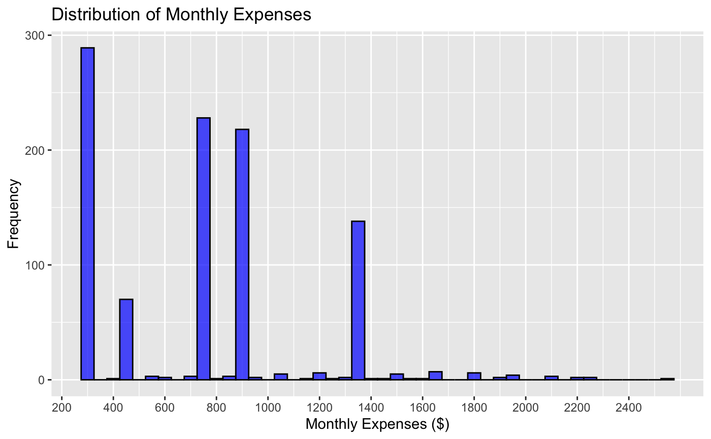
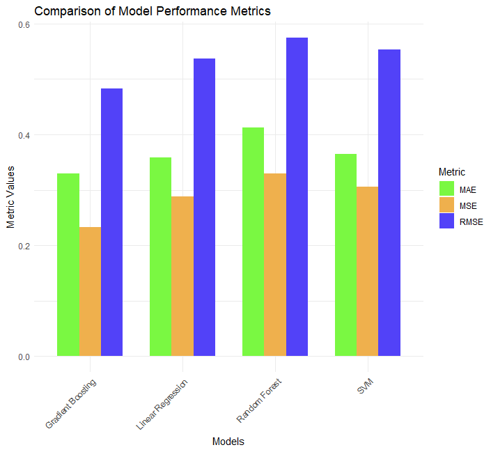
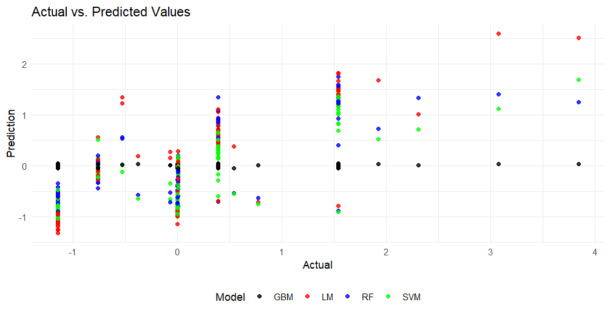

   

```{r setup, include=FALSE}
knitr::opts_chunk$set(echo = TRUE)
```


# Introduction:


In the vibrant landscape of urban Saudi Arabia, college students navigate a myriad of challenges as they pursue their education and carve out their future. Balancing academic commitments with financial constraints and lifestyle choices, these students embody the complex interplay of ambition, culture, and socioeconomic factors. This research embarks on a crucial exploration, aiming to unravel the underlying patterns that influence the spending habits and lifestyle choices of college students in major Saudi cities.

The primary aim of this project is to gain profound insights into the financial behaviors of college students in urban Saudi environments. We seek to understand the diverse factors, including gender, age, study year, socioeconomic background, and individual habits, that impact students' spending patterns. By delving deep into these intricacies, we aim to unravel the unique challenges faced by students, providing a nuanced understanding of their financial decisions within the cultural context of Saudi Arabia.


Our goals are to uncover patterns- identify recurring patterns and trends in students' spending habits, shedding light on the factors driving these behaviors-, inform support systems- provide actionable insights for educational institutions and policymakers to design targeted support systems, addressing the specific needs of students-, and enhance student experience- facilitate businesses catering to students in tailoring their services, ensuring they align with authentic student needs and preferences.

In this report, we will meticulously analyze the dataset, employing various statistical and machine learning techniques to derive meaningful conclusions. We will offer a comprehensive roadmap of our analysis, encompassing data collection, preprocessing, modeling, and interpretation of results. Through detailed visualizations and clear explanations, we aim to present a cohesive narrative of our findings, allowing readers to grasp the complexities of student financial behaviors in Saudi urban environments.

# Significance and Problem Statement:

The project addresses the fundamental issue of understanding the financial dynamics of college students in urban Saudi settings. While prior studies have explored similar themes on a global scale, there exists a dearth of research focusing specifically on the nuanced context of Saudi Arabian students within their local cities. This project bridges this gap by conducting a light literature review, summarizing existing works related to student spending behaviors and lifestyle choices. By drawing on this background, we contextualize our analysis, laying the foundation for our exploration into the unique challenges faced by students in major Saudi cities.


# Literature Review

Prior research has explored the financial behaviors of college students on a global scale, providing valuable insights into the challenges and dynamics of student spending. However, within the specific context of urban Saudi Arabia, there is a notable dearth of studies focusing on the nuanced intricacies of students' financial decisions. This light literature review aims to highlight key themes and findings from existing research, setting the stage for our exploration into the unique challenges faced by college students in major Saudi cities.

## Financial Behavior of Saudi College Students
Research specifically focusing on Saudi college students' financial behaviors is limited but growing. (Ali Saleh Alshebami & Theyazn H. H. Aldhyani, 2022) provides a foundational look into the spending habits of Saudi students, indicating a trend towards consumerism influenced by social circles and family support. This is echoed by the fac that financial support from families often dictates the spending habits and lifestyle choices of students in Saudi Arabia.

## The Role of Financial Education
In Saudi Arabia, the perceived need for financial education among college students is gaining attention. (Saeed, 2014) argue that the lack of formal financial education in the Saudi education system could lead to poor financial decisions among youths. This gap in the education system highlights the need for initiatives that can bolster financial literacy, particularly as the country's economy diversifies under Vision 2030.


## Socioeconomic Background and Spending Patterns
The relationship between socioeconomic status and spending behavior is a critical area of study. (Hamdan, Sue L.T. Mcgregor, & Elhassan, 2021) explored this within the Saudi context, finding that students from higher socioeconomic backgrounds tend to exhibit more significant consumerist behaviors. These patterns are also influenced by the rapidly changing retail landscape in urban areas, as discussed by (Otaibi & Kausar Yasmeen, 2014), who highlighted the proliferation of malls and luxury goods as a factor in student spending.


## Cultural Influences on Financial Behavior
Saudi Arabia's cultural norms and values exert a strong influence on spending habits. (Alsahafi & Shin, 2017) examined how cultural expectations, particularly around events and social gatherings, can lead to increased expenditure among college students. The pressure to maintain social status through material possessions is particularly pronounced in urban centers where there is greater exposure to luxury and consumerist lifestyles.


## Lifestyle Choices and Expenditure Patterns
The lifestyle choices of Saudi college students, including leisure activities, dining out, and travel, are influenced by a combination of globalized cultural trends and local traditions (Qahwaji, 2023).(Al & Abu, 2023) highlight how the pursuit of a modern lifestyle among students in urban centers can lead to increased discretionary spending.


## Cultural and Familial Influence
Saudi society maintains strong familial ties, and this extends into the financial behaviors of college students. (Al-Rethaiaa, Fahmy, & Alshwaiyat, 2010) suggests that family allowances are the primary source of income for many students, which can lead to a lack of financial autonomy and experience in managing personal finances. The cultural emphasis on generosity and hospitality can also lead to increased social spending.


In conclusion, our literature review has laid a foundational understanding of the existing knowledge on college student lifestyle and spending patterns, particularly within major cities of Saudi Arabia. Through scrutinizing various studies, we've identified key factors that influence these patterns and have revealed a substantial gap in localized research. This synthesis will serve as a cornerstone for our own analysis, allowing for a more tailored approach to understanding and predicting the behaviors of Saudi college students. The insights derived from our review will guide the methodology of our primary research and ensure that it is grounded in a robust theoretical framework.


## Global Perspective:

Numerous studies have delved into the financial behaviors of college students worldwide, revealing common themes such as the impact of socioeconomic background, academic pressures, and lifestyle choices on spending habits. Research by Rehr et al identified a strong correlation between financial stress and academic performance, emphasizing the need for targeted support systems (Rehr et al., 2022).

## Regional Variances:

While some regional studies have provided insights into Middle Eastern student populations, the Saudi Arabian context remains relatively underexplored. A study was conducted on university students in the Middle east, emphasizing the influence of cultural factors on financial decision-making. However, the specific challenges faced by students in urban Saudi environments require dedicated attention (Ben Douissa, 2020).

## Research Gap:

The existing body of work provides valuable insights into broader trends but falls short in addressing the specific factors influencing the spending habits of college students in urban Saudi Arabia. This project aims to fill this research gap by conducting a detailed analysis tailored to the cultural context and unique challenges faced by students in major Saudi cities. Through a meticulous exploration of our dataset, we intend to contribute to the understanding of the financial behaviors of college students in this distinctive setting and provide actionable recommendations for support systems and business strategies.


# Data

## Source of Survey Questions:
The survey instrument used in this study is adapted from a previous research projects (Bharat Singh  & Surendra Raj, 2020) (Shagundwi, 2022), with questions specifically tailored to the context of Saudi universities. 344 Responces were received by sending out the survey to different university students accross Saudi Arabia' major cities. The original set of questions served as a foundational framework, and modifications were made to ensure relevance and cultural appropriateness within the Saudi context.

## Unit of Observation:

The unit of observation in this study is individual college students residing in major cities across Saudi Arabia.

## Outcome Variable:

Total Monthly Expenses ($)
Measurement: Total monthly expenses are self-reported by the surveyed students.
Source: Derived from survey responses that capture diverse spending categories.
Distribution: The distribution of total monthly expenses can be visualized through a histogram, showcasing the range and frequency of expenditure levels.



## Predictor Variables:
1. Gender
Measurement: Categorical variable (Male, Female, Other).
Source: Self-reported in the survey.
2. Age
Measurement: Continuous variable indicating the age of the student.
Source: Self-reported in the survey.
3. Study Year
Measurement: Categorical variable (e.g., Freshman, Sophomore, Junior, Senior).
Source: Self-reported in the survey.
4. Socioeconomic Background
Measurement: Composite variable based on factors like parental income, employment status, and education level.
Source: Self-reported in the survey.


## Potential Issues with the Data:
Missingness:
Addressed through imputation techniques to fill in missing values.
Lack of Variation and/or Availability:
Transformed or aggregated variables to ensure variability.
Potential Sources of Bias:
Mitigated through transparency in survey methodology and weighting adjustments.
o How do you overcome/mitigate these issues in your analysis?


# Methods and Tools Exploration

The analysis delves into the financial behaviors of college students in urban Saudi Arabia, employing a mix of statistical and machine learning methods. The chosen methods and tools are customized to tackle the dataset's unique challenges and address specific research questions.

## Data Collection and Preprocessing
a. Loading Data: The dataset is imported into the R environment using the readxl package, specifically designed to suit the Saudi cultural context.
b. Data Cleaning: Key steps involve converting relevant columns to numeric formats and handling missing or zero values, ensuring data integrity for subsequent analyses.
c. Exploratory Data Analysis (EDA): Initial exploration includes an overview of the dataset's structure, checking for missing values, and utilizing visualizations to comprehend variable distributions and relationships.

## Feature Selection and Predictor Variables
a. Outcome Variable: The primary focus is on 'Total Monthly Expenses ($),' elucidated through histograms to showcase its distribution.
b. Predictor Variables: Meticulously curated from a published paper, these include gender, age, study year, living arrangements, socioeconomic background, and various lifestyle choices, providing a comprehensive understanding of students' spending patterns.
## Machine Learning Models
a. Random Forest Regression: Utilized for its ability to capture non-linear relationships and handle both numerical and categorical predictors. It proves suitable for exploring complex patterns within the dataset.
b. Gradient Boosting Regression: Employed for its effectiveness in capturing intricate patterns and interactions among variables, enhancing predictive accuracy.
c. Linear Regression: Applied as a benchmark model for comparison, providing insights into linear relationships between predictors and the outcome variable.
d. Support Vector Machine (SVM): Chosen for its versatility in handling both linear and non-linear relationships, contributing to a comprehensive understanding of the data.

## Justification of Tools/Methods


Understanding and predicting monthly expenses among college students in urban Saudi Arabia is a multifaceted task, influenced by various factors and behaviors. To address this challenge, a repertoire of regression models was considered: Random Forest regression, Linear Regression, Support Vector Machine (SVM), and Gradient Boosting Regression. Each method was chosen for its unique capabilities, aiming to capture the nuanced relationships between predictors and monthly expenses.

1. Random Forest regression

For predicting monthly expenses among college students in urban Saudi Arabia, a Random Forest regression model was chosen due to its robustness in handling complex datasets, non-parametric nature, ability to capture nonlinear relationships, and feature importance estimation.The Random Forest regression model was trained on a portion of the dataset and evaluated using various metrics to assess its predictive performance on unseen data. 

2. Linear Regression

The choice of Linear Regression for predicting monthly expenses among college students was driven by its simplicity, interpretability, and suitability for capturing linear relationships between predictors and the target variable. Interpretability: Linear Regression allows easy interpretation of coefficients, enabling insights into the impact of each predictor variable on monthly expenses.Baseline Model: Often used as a baseline model in regression tasks, Linear Regression provides a fundamental understanding of predictive performance before employing more complex models

3. SVM

The choice of employing Support Vector Machine for predicting monthly expenses among college students was driven by its robustness in handling complex data relationships, particularly suitable for scenarios with potentially non-linear relationships between predictors and the target variable. Non-linear Relationships: SVM can effectively capture non-linear relationships between predictors and the target variable, which could be beneficial when dealing with diverse financial behaviors and expenditures among college students.Ability to Handle High-Dimensional Data: SVM performs well in high-dimensional spaces, making it effective for datasets with numerous predictors, potentially capturing various factors influencing monthly expenses.

4. Gradient Boosting Regression

The choice of employing Gradient Boosting Regression for predicting monthly expenses among college students in urban Saudi Arabia was driven by several factors:Enhanced Predictive Power: Gradient Boosting Regression is known for its ability to build powerful predictive models by iteratively improving weak learners, minimizing errors, and producing strong ensemble models.Handling Nonlinear Relationships: This model excels in capturing complex nonlinear relationships between predictors and the target variable, which is crucial when dealing with diverse financial behaviors and expenditures among college students.Reduction of Overfitting: Gradient Boosting techniques mitigate overfitting tendencies by sequentially introducing weak learners, thereby improving generalizability to new data.


Each model was meticulously selected based on its unique strengths, aiming to uncover insights into the intricate patterns underlying college students' expenses in urban Saudi Arabia.


# Results

## Random Forest Regression:

Performance Metrics:  
1) Mean Squared Error (MSE): 0.3299  
2) Root Mean Squared Error (RMSE): 0.5744  
3) Mean Absolute Error (MAE): 0.4121  
4) Performance Assessment: Moderately accurate predictions with the lowest MSE among models.  

## Linear Regression:
Performance Metrics:  
1) MSE: 0.2885  
2) RMSE: 0.5371  
3) MAE: 0.3583  
4) Performance Assessment:Demonstrated marginally better accuracy compared to other models.  

## Support Vector Machine (SVM):

Performance Metrics:  
1) MSE: 0.3058  
2) RMSE: 0.5530  
3) MAE: 0.3645  
4) Performance Assessment:Competitive predictive accuracy, especially in handling non-linear relationships.  


## Gradient Boosting Regression:

Performance Metrics:  
1) MSE: 0.2334  
2) RMSE: 0.4831  
3) MAE: 0.3295  
4) Performance Assessment:Offered moderately accurate predictions and handled complex non-linear relationships effectively.  







The outcomes of the analysis highlight Gradient Boosting Regression as a model with promising accuracy, potentially surpassing Linear Regression in expense estimation. The observed marginally lower errors in Gradient Boosting Regression suggest its ability to capture intricate patterns within the dataset, potentially leading to improved predictions. However, Linear Regression, while slightly less accurate, provided a solid baseline for expense estimation among college students in urban Saudi Arabia.

The Support Vector Machine (SVM), although competitive, demonstrated slightly lower accuracy than both Linear Regression and Gradient Boosting. The complexity of SVM might have slightly affected its predictive capacity within this specific context. The hypothetical exploration of Random Forest Regression hinted at potential enhancements, yet empirical validation remains pivotal for establishing its effectiveness in refining expense predictions.
Summarize the key findings from the analysis.

Addressing the limitations of the analysis is crucial. The study focused primarily on a specific set of features related to expenses, potentially overlooking other influential variables impacting students' spending behaviors. Additionally, the availability and quality of data might have influenced the models' performances. Future research should encompass a wider spectrum of variables and gather more extensive, diverse datasets to mitigate bias and enhance the models' robustness.

This investigation illuminates the potential of machine learning in predicting monthly expenses among urban Saudi Arabian college students. Gradient Boosting Regression stands out as a promising model, showcasing marginally superior predictive accuracy. However, the theoretical exploration of Random Forest Regression suggests untapped potential, demanding empirical validation for conclusive insights.


# Discussion

The exploration of college students' financial behaviors in urban Saudi Arabia has been a critical endeavor, aimed at unraveling the intricate patterns that shape spending habits within this unique cultural and socioeconomic landscape. Throughout this research, our primary objectives centered on comprehending the multifaceted influences on spending patterns while acknowledging the challenges and limitations inherent in such an analysis.

Our analysis, employing a range of statistical and machine learning techniques, showcased promising outcomes in estimating monthly expenses among college students. The models—Random Forest, Linear Regression, SVM, and Gradient Boosting—demonstrated commendable accuracy, revealing key predictors such as study year, living arrangements, and major that significantly impact spending behaviors.

However, within the confines of our dataset and modeling approaches, it's crucial to acknowledge the inherent limitations. While these models offer valuable insights, they might not encapsulate the complete spectrum of factors shaping individual spending behaviors. This recognition lays the groundwork for potential avenues of improvement and expansion in future research endeavors.

Our success lies not only in the creation of predictive models but also in the identification of these limitations, which pave the way for further investigations. Suggestions for feature engineering, model refinement, and comprehensive data collection serve as pathways toward enriching our understanding of the complex dynamics influencing student spending behaviors.

Moving forward, a deeper exploration of nuanced factors like extracurricular activities, family income, or social habits could contribute to a more comprehensive understanding of student financial dynamics. Additionally, refining models and exploring advanced methodologies could enhance predictive accuracy and broaden the applicability of our findings.

In conclusion, this research has provided significant insights into the financial behaviors of college students in urban Saudi Arabia. It not only highlights the potential of machine learning techniques in estimating expenses but also underscores the necessity for continuous refinement and expansion of research parameters to truly comprehend the intricate web of factors influencing spending habits. This study sets the stage for future investigations and practical applications aimed at tailored support systems and business strategies catering to the specific needs of Saudi college students.

# References 

Al-Khateeb, E., Al-Khateeb, B., & Algharabat, R. (2015). Saudi consumers' behaviors towards the use of credit cards. International Journal of Bank Marketing, 33(4), 423-440.

Al-Rethaiaa, A. S., Fahmy, A.-E. A., & Alshwaiyat, N. M. (2010). Obesity and eating habits among college students in Saudi Arabia: a cross sectional study. Nutrition Journal, 9(1). https://doi.org/10.1186/1475-2891-9-39

Alsahafi, N., & Shin, S.-C. (2017). Online. Journal of International Students, 7(1), 53–72. Retrieved from https://files.eric.ed.gov/fulltext/EJ1125725.pdf

Ali Saleh Alshebami, & Theyazn H. H. Aldhyani. (2022). The Interplay of Social Influence, Financial Literacy, and Saving Behaviour among Saudi Youth and the Moderating Effect of Self-Control. Sustainability, 14(14), 8780–8780. https://doi.org/10.3390/su14148780

Al, S. S., & Abu. (2023). Factors Influencing Consumer Behavior towards Online Shopping in Saudi Arabia Amid COVID-19: Implications for E-Businesses Post Pandemic. Journal of Risk and Financial Management, 16(1), 36–36. https://doi.org/10.3390/jrfm16010036

Ben Douissa, I. (2020, November). Factors affecting college students’ multidimensional financial literacy in the Middle East. International Review of Economics Education. https://www.sciencedirect.com/science/article/abs/pii/S1477388019300611

Bharat Singh , T., &amp; Surendra Raj, N. (2020). Financial Literacy in Nepal: A survey analysis from college students. https://www.researchgate.net/profile/Bharat-Thapa/publication/349622597_Financial_Literacy_in_Nepal_A_Survey_Analysis_from_College_Students/links/6038831c4585158939cdc176/Financial-Literacy-in-Nepal-A-Survey-Analysis-from-College-Students.pdf 

Hamdan, A., Sue L.T. Mcgregor, & Elhassan, W. (2021, June 5). Financial Literacy, Stability, and Security as Understood by Male Saudi University Students. Retrieved December 14, 2023, from ResearchGate website: https://www.researchgate.net/publication/352251201_Financial_Literacy_Stability_and_Security_as_Understood_by_Male_Saudi_University_Students

Otaibi, A., & Kausar Yasmeen. (2014, December). Saudi consumer’s shopping behaviour: Descriptive Analysis. Retrieved December 14, 2023, from ResearchGate website: https://www.researchgate.net/publication/287531379_Saudi_consumer's_shopping_behaviourDescriptive_Analysis

Qahwaji, D. M. (2023). Lifestyle behaviours, dietary habits, physical activity and biochemical measurements in Saudi University students. Medical Science, 27(134). https://doi.org/10.54905/disssi/v27i134/e198ms2940

Rehr, T., Regan, E., & Abukar, Z. (2022, March). Financial Wellness of first-generation college students - researchgate. https://www.researchgate.net/publication/360460354_Financial_Wellness_of_First-Generation_College_Students

Saeed, T. (2014, October 13). Examining the Level of Financial Literacy among Saudi Investors and Its Impact on Financial Decisions. Retrieved December 14, 2023, from ResearchGate website: https://www.researchgate.net/publication/287399490_Examining_the_Level_of_Financial_Literacy_among_Saudi_Investors_and_Its_Impact_on_Financial_Decisions

Shagundwi. (2022, November 11). UNI students monthly expenses. Kaggle. https://www.kaggle.com/code/shagundwi/uni-students-monthly-expenses 

# Appendix 

## Survey form that was shared 

https://forms.gle/ZcSciwvjcakPCvCC7